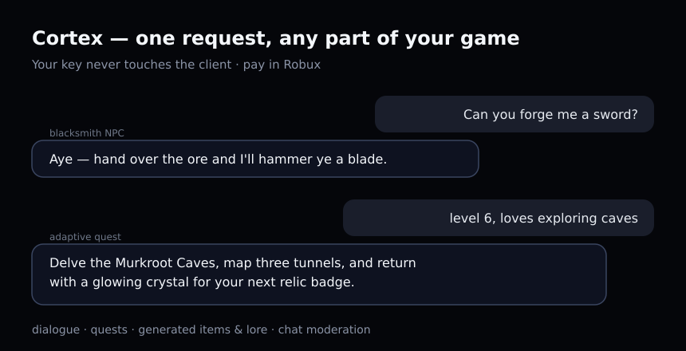

# Cortex — AI for any part of your Roblox game



One server-side HTTP request gives your game a brain: **dialogue, adaptive quests,
generated items & lore, chat moderation** — anything text-shaped. ~3 seconds a call.

- **Your key never touches the client.** All calls go from a server Script.
- **Pay in Robux** via a game pass. No cards, no backend to run.
- **Open beta — free keys for the first devs.** Grab one in the Discord.

## Correct by default
Most AI-in-Roblox tutorials leave out the server-side plumbing — so games ship
with the "only the first player gets a reply" bug, no retries, no rate limit, and
raw model text shown to kids. This SDK does that part **for you, on by default**:

- **Per-player cooldown** — state keyed by `UserId`, so one player spamming can't
  starve everyone else, and the global-debounce bug can't happen.
- **Retry + backoff on 429/5xx** — transient hiccups get retried, not shown to players.
- **Response cache** — identical prompts come back free and don't burn a request
  against the HttpService **500 req/min** server cap.
- **Moderation built in** — `ai:moderate(text)` (SAFE/BLOCK by meaning) and
  `ai:filterForPlayer(text, player)` (Roblox's own text filter) so you never
  display unfiltered AI output.
- **NPC objects** — `ai:npc{...}` gives per-player memory and correct multiplayer
  state with three lines of code.

## 🎁 Beta rewards
First testers get:
- **Free keys** now + a generous starter pack of units.
- A **permanent founder discount** when Cortex goes paid (you were here first).
- A **Robux reward + your game featured** on Cortex's channels if you ship it in a
  live game and share feedback.
- Bring another dev who tests it → **bonus units/Robux for both of you.**

## Install
1. Put `src/Cortex.lua` into **ServerStorage** as a ModuleScript named `Cortex`.
2. Turn on **Game Settings → Security → Allow HTTP Requests**.
3. Get a free beta key → **https://discord.gg/A3MSqwkvn7**

## Use (server Script only)
```lua
local Cortex = require(game.ServerStorage.Cortex)
local ai = Cortex.new("YOUR_KEY")

local line = ai:ask("You are a gruff blacksmith. One short line.", "forge me a sword?")
print(line) --> "Aye — hand over the ore and I'll hammer ye a blade."
```

`ask(instructions, input, tier?)` → `text, unitsLeft`.
Tiers: `osa-fast` (quick), `osa-smart` (richer), `osa-cheap` (bulk), `osa-auto` (picks for you).

### A talking NPC in ~5 lines (memory + moderation handled for you)
```lua
local ai = Cortex.new("YOUR_KEY", { perPlayerCooldown = 1.5 })
local bramm = ai:npc({
    personality = "You are Bramm, a gruff dwarven blacksmith. One or two short lines.",
    moderate = true, -- blocks nasty player input before it hits the model
})

-- in your talk handler:
local reply = bramm:say(player, message)          -- per-player memory + cooldown
if reply then
    local safe = ai:filterForPlayer(reply, player) -- always filter before showing
    -- show `safe` in a chat bubble / BillboardGui
end

game.Players.PlayerRemoving:Connect(function(p) bramm:forget(p) end)
```

Full runnable version: `examples/npc.server.lua`.
Dialogue, item text, quests and moderation: `examples/demo.server.lua`.

## API at a glance
| call | does |
|---|---|
| `Cortex.new(key, opts?)` | `opts`: `tier`, `perPlayerCooldown`, `maxRetries`, `cacheTtl`, `cacheEnabled` |
| `ai:ask(system, input, tierOrOpts?)` | one reply; `opts.player` turns on per-player cooldown |
| `ai:moderate(text)` | `"SAFE"` / `"BLOCK"` by meaning |
| `ai:filterForPlayer(text, player)` | Roblox text-filtered string, safe to display |
| `ai:npc{personality=…, moderate?=…}` | NPC with per-player memory: `npc:say(player, msg)`, `npc:forget(player)` |

## Optional: "AI by Cortex" badge
`src/PoweredBy.lua` shows a small tag in your game. Keeping it on the free tier is
optional but appreciated — it helps other devs find Cortex (and it's how you unlock
referral rewards). Paid tier removes it.

## Links
- Demo & docs: https://cortex-rbx.github.io
- Beta key & support: https://discord.gg/A3MSqwkvn7

_Beta: free keys for testers, no 24/7 uptime guarantee yet._
